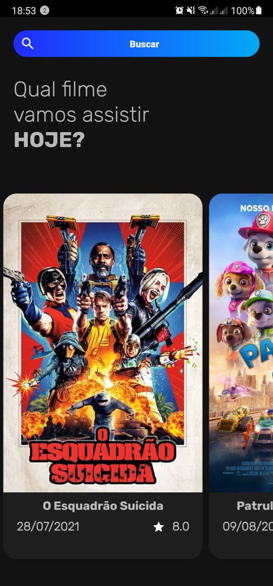
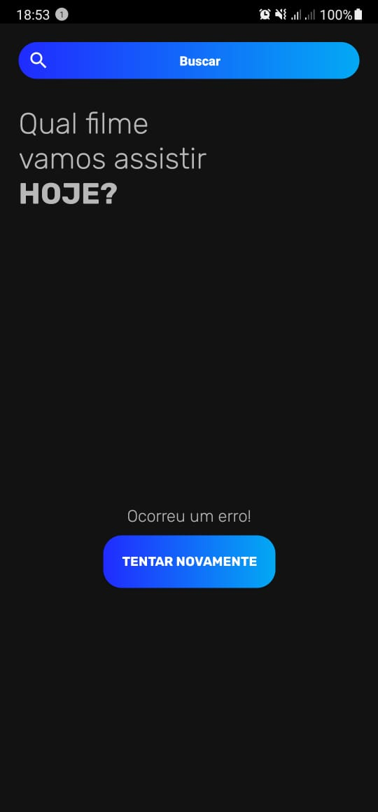
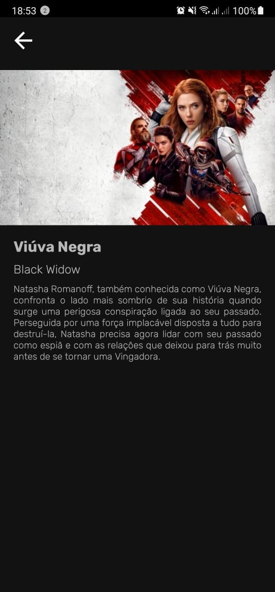
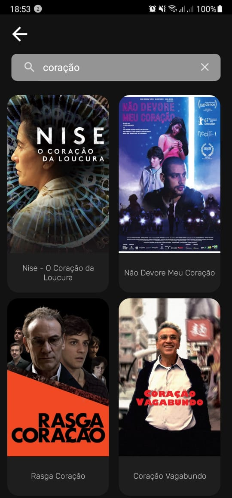

# TodaysMovies

Projeto pessoal utilizando a API de filme do TMDB

### Tecnologias utilizadas
* Kotlin
* MVVM com Clean Architecture
* Consumo de API (Coroutines + Retrofit)
* Okhttp
* Gson
* Glide
* LiveData
* ViewModel
* Navigation
* Injeção de Dependência (Koin)

### Próximas implementações
* Testes unitários (Mockito)
* Testes de UI (Espresso)

## Screenshots

  
   

  
   

